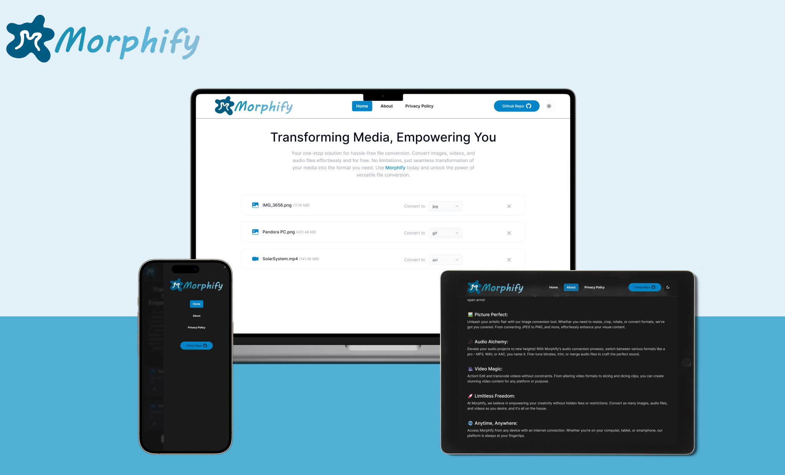

<div align="center">
  
</div>

# Morphify

Introducing Morphify, your gateway to seamless multimedia conversion. With Morphify, you can effortlessly transform images, audio files, and videos, all without spending a dime. Say goodbye to limitations and welcome endless creative possibilities with open arms!

## Demo

Morphify is deployed to Vercel. You can try it on the following URL: [morphify.vercel.app](https://morphify.vercel.app/).

<div align="center">
  
</div>

## Technologies Used

- React.js
- Next.js 13
- TypeScript
- FFmpeg WASM
- Tailwind
- Shadcn UI

## Installation

To install and run Morphify locally, follow these steps:

1. Clone the project repository.
2. Navigate to the project directory.
3. Install the necessary dependencies by running the following command:

```
npm install
```

4. Run the project by executing the following command:

```
npm run dev
```

5. Access the application by visintg http://localhost:3000/
